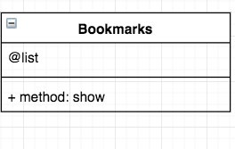

## User Stories

```
As a user,
So I can remind myself of important webpages,
I would like to see a list of bookmarks.
```

```
As a user,
So I can go back to important webpages,
I would like to be able to add bookmarks.
```



## Setup

Setting up the SQL development database

```
> psql postgres
> CREATE DATABASE bookmark_manager;
> \c bookmark_manager
> CREATE TABLE bookmarks(id SERIAL PRIMARY KEY, url VARCHAR(60));
```

Setting up the SQL test database

```
> psql postgres
> CREATE DATABASE bookmark_manager_test;
> \c bookmark_manager
> CREATE TABLE bookmarks(id SERIAL PRIMARY KEY, url VARCHAR(60));
```
